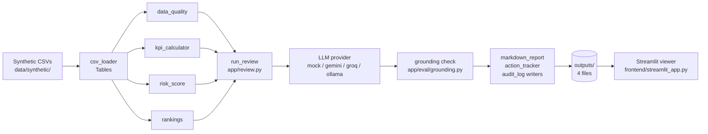
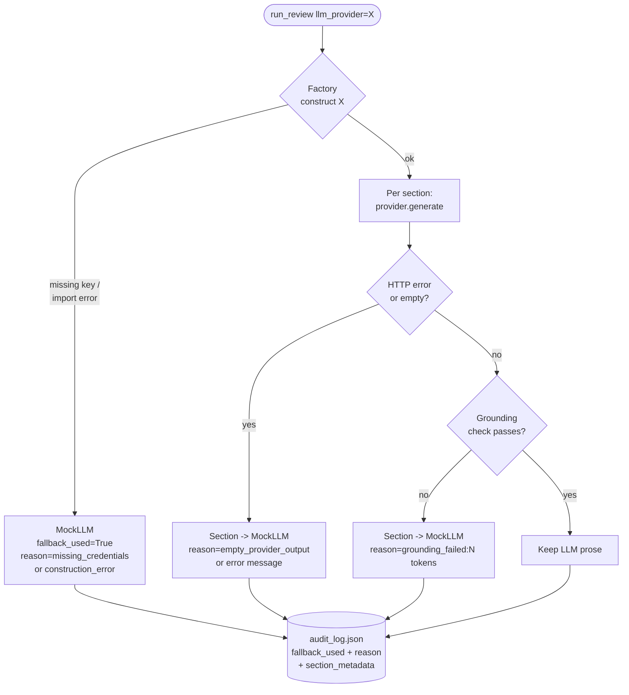

# Architecture

> ⚠️ **Synthetic data only.** ShikshaSignal AI runs on a deterministic, seeded synthetic dataset that resembles DIKSHA / UDISE / NAS shapes. No real student, teacher, school, or district records are used and no PII (Aadhaar / APAAR) is processed. Every number in this document and in generated outputs comes from `data/synthetic/*.csv`.

## Design rule

> The LLM never calculates, ranks, or invents numbers.
> Deterministic Python produces every KPI, risk score, and ranking.
> The LLM only narrates verified facts; a grounding check enforces this on every run.

This rule is load-bearing. It is what lets a District Education Officer trust the memo without re-checking every figure. It is enforced in three places: the compiler shape (numbers are computed first, then narrated), the per-section grounding check (`app/eval/grounding.py`), and the audit log (which records any ungrounded tokens that triggered a fallback).

## High-level system diagram

## Data flow

1. **Load** — `app.tools.csv_loader.load_all(...)` reads the seven synthetic CSVs into a `Tables` dataclass with schema validation.
2. **Assess** — `app.tools.data_quality.assess_quality(tables)` produces a `DataQualityReport` (coverage, findings, DQ score 0–100).
3. **KPI** — `app.tools.kpi_calculator.district_summary(tables, district=...)` computes per-KPI actual vs target with status, using `data/policy_map.yaml`.
4. **Risk** — `app.tools.risk_score.compute_school_risk(...)` produces decomposed component scores → `compute_block_risk(...)` aggregates → `band_split(...)` produces the Low/Medium/High mix.
5. **Rank** — `app.tools.rankings.build_school_ranking(...)` orders schools by risk; `whats_changed(...)` finds usage decliners.
6. **Compile facts** — `app.review.build_review_facts(...)` packs the above into one JSON-serialisable dict (this dict is the *only* source of truth the LLM ever sees).
7. **Narrate** — `app.review._narrate_all(...)` walks every section in `app.llm.base.SUPPORTED_SECTIONS` and asks the provider (mock/gemini/groq/ollama) to render prose using `app.llm.prompts`.
8. **Ground** — per section, `app.eval.grounding.check_grounding(prose, facts)` rejects any numeric token not traceable to `review_facts.json` (plus a tiny allowlist).
9. **Fall back** — call-time errors or grounding misses re-render that section via `MockLLM`; `--strict-grounding` re-renders the whole memo with `MockLLM` if any section failed.
10. **Render** — `app.reporting.markdown_report.render_review_markdown(...)` assembles the memo; `app.reporting.action_tracker.build_action_tracker(...)` builds the CSV.
11. **Audit** — `app.reporting.audit_log.build_audit_log(...)` records files read, files written, provider used, fallback reason, grounding failures, per-section telemetry.
12. **View** — `frontend/streamlit_app.py` reads the four artefacts through `app.services.artifact_reader` and renders five tabs.

## Module breakdown

| Module | Role | Language-level seam |
|---|---|---|
| `app.config` | Constants: paths, `RISK_WEIGHTS`, `RISK_BANDS`, `FOCUS_DISTRICT`, model version | Module-level frozen dicts |
| `app.tools.csv_loader` | Reads + schema-checks seven CSVs into a `Tables` object | `Tables` dataclass + `load_all(path)` |
| `app.tools.data_quality` | Coverage, duplicate IDs, invalid percents, orphan joins, future dates | `DataQualityReport` dataclass + `assess_quality(tables)` |
| `app.tools.kpi_calculator` | Maps raw metrics to policy KPIs and statuses | `district_summary(tables, district)` + `load_policy_targets()` |
| `app.tools.risk_score` | Weighted decomposed risk (7 components) + banding | `compute_school_risk`, `compute_block_risk`, `band_split` |
| `app.tools.rankings` | School ranking + "what changed" usage decliners | `build_school_ranking`, `whats_changed` |
| `app.review` | Orchestrator: fact build, narration, fallback, write artefacts | `run_review(...)` + `ReviewArtifacts` dataclass |
| `app.llm.base` | Provider protocol + result/error types + `SUPPORTED_SECTIONS` | `BaseLLMProvider` ABC, `GenerationResult`, `MissingCredentialsError` |
| `app.llm.factory` | Resolves a provider name to a working instance; falls back to mock | `get_provider(name)` → `ProviderResolution` |
| `app.llm.mock_llm` | Offline Jinja-templated narrator; the trust-preserving default | `MockLLM(BaseLLMProvider)` |
| `app.llm.gemini_provider` | Google Gemini HTTP client (free tier) | `GeminiProvider(BaseLLMProvider)` |
| `app.llm.groq_provider` | Groq Cloud HTTP client (free tier) | `GroqProvider(BaseLLMProvider)` |
| `app.llm.ollama_provider` | Local Ollama HTTP client (no key) | `OllamaProvider(BaseLLMProvider)` |
| `app.llm.prompts` | Section system prompts + `GROUNDING_RULES` block | Module-level prompt strings |
| `app.reporting.markdown_report` | Assembles the final markdown memo | `render_review_markdown`, `write_review_markdown` |
| `app.reporting.action_tracker` | Builds the proposed-action CSV (status=proposed) | `build_action_tracker`, `write_action_tracker`, `ACTION_COLUMNS` |
| `app.reporting.audit_log` | Builds + writes the per-run audit JSON | `AuditLog` dataclass + `build_audit_log` + `write_audit_log` |
| `app.eval.grounding` | Number extraction + set-membership check | `check_grounding(memo, facts)` |
| `app.services.artifact_reader` | Loads the four output files for the viewer | Module-level loader functions |
| `frontend.streamlit_app` | Five-tab read-only viewer over `outputs/` | Streamlit script |

## Deterministic vs LLM responsibilities

| Deterministic core (Python) | LLM layer (mock / gemini / groq / ollama) |
|---|---|
| Load + schema-validate CSVs | Executive summary narrative |
| Compute every KPI vs policy target | "What changed" narrative |
| Compute decomposed risk score + banding | Top-blocks section intro |
| Aggregate block-level risk | Top-schools section intro |
| Build school and block rankings | Data-quality warnings intro |
| Compute "what changed" usage decliners | Policy observations intro |
| Data-quality findings + DQ score | Root-cause hypothesis intro |
| ID reconciliation (orphans, duplicates) | Recommended-actions intro |
| Action selection rules (which schools, which template) | BRC message draft |
| Hypothesis selection rule (driver → template) | DEO message draft |
| Audit-log field assembly | Meeting questions draft |
| Build `review_facts.json` (single source of truth) | Assumptions paragraph |

The LLM emits **prose only**. If the prose contains a numeric token that is not present in `review_facts.json` (or in the tiny `{0,1,2,100}` allowlist), the section is discarded and `MockLLM` renders it from a Jinja template.

## Provider fallback flow

Every transition is captured in `audit_log.json`:
* construction-time fallback → `fallback_used=True`, `fallback_reason="missing_credentials:..."` or `"construction_error:..."`;
* call-time fallback → `section_metadata[section].fallback_used=True` with the underlying error;
* grounding fallback → `grounding_failures[section]` lists the offending tokens.

With `--strict-grounding`, if *any* section fell back, the orchestrator re-renders the entire memo from `MockLLM` so the document is uniform.

## Grounding flow

1. The provider returns rendered prose for one section.
2. `app.eval.grounding.memo_numbers(prose)` extracts every numeric token with the regex `(?<![\w-])-?\d+(?:\.\d+)?(?:%)?(?!\w)` — this deliberately skips IDs like `D01_B03` and ISO weeks like `2026-W22`.
3. `grounded_numbers(facts)` recursively walks `review_facts.json` and collects every numeric token, then unions in the tiny allowlist `{0, 1, 2, 100}` (axis labels, rank counters, scale max).
4. Tokens are normalised: `12%`, `12.0%`, `+12`, `12` all collapse to `"12"`. Floats with no fractional part collapse to their integer form.
5. Any memo token not in the grounded set is "ungrounded". A non-empty ungrounded list triggers per-section fallback to `MockLLM` (the template path is grounded by construction).
6. Per-section ungrounded tokens are recorded in `audit_log.grounding_failures` so a reviewer can see exactly what the LLM tried to invent.

## Artifact generation flow

Every run writes exactly four files into `outputs/`:

* **`outputs/monthly_district_review.md`** — produced by `app.reporting.markdown_report.render_review_markdown(facts, narratives)`. Consumes the full `facts` dict (numbers) plus the per-section `narratives` dict (prose).
* **`outputs/action_tracker.csv`** — produced by `app.reporting.action_tracker.build_action_tracker(school_ranking, district, top_n=...)`. Consumes the deterministic school ranking; every row starts `status=proposed`.
* **`outputs/audit_log.json`** — produced by `app.reporting.audit_log.build_audit_log(...)`. Consumes the command args, the resolved provider, the per-section metadata, grounding failures, and the list of output paths.
* **`outputs/review_facts.json`** — written by `app.review._write_facts_json(facts, ...)`. Consumes the assembled `facts` dict (with the in-memory `_action_tracker_df` stripped). This file is the grounding reference for the memo.

Separately, `app.tools.rankings` writes `outputs/risk_ranking.csv` and `outputs/block_risk_ranking.csv` when invoked as a script, for quick offline inspection.
